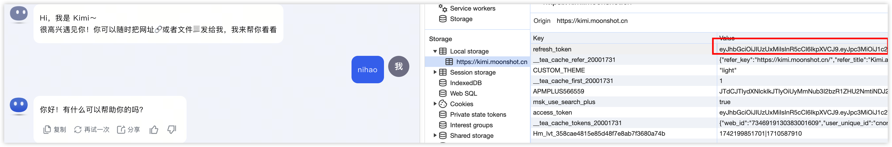
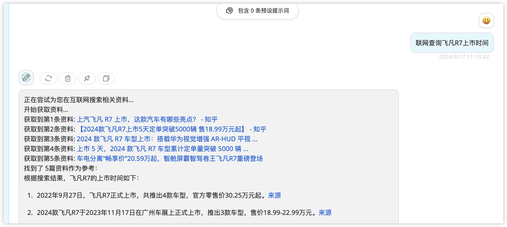
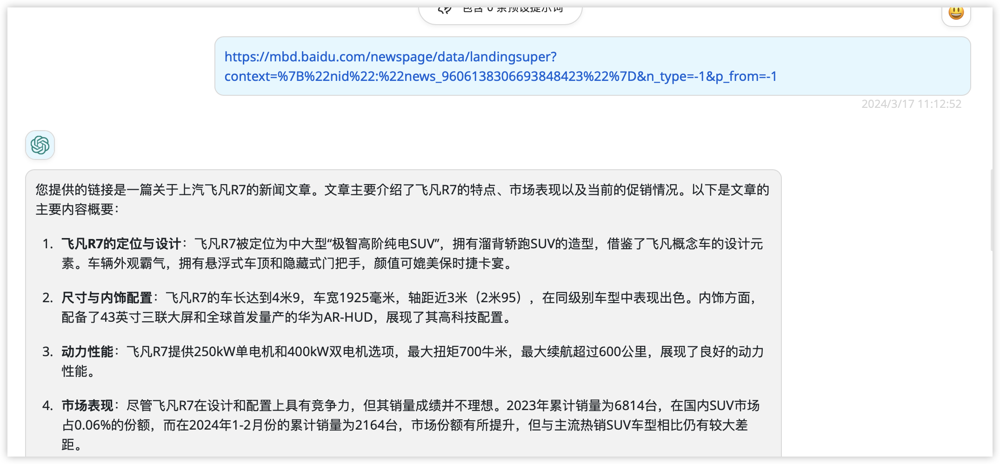
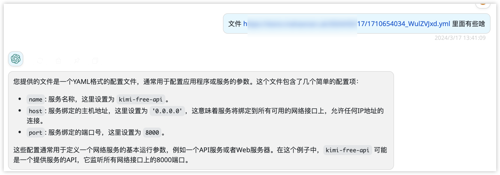
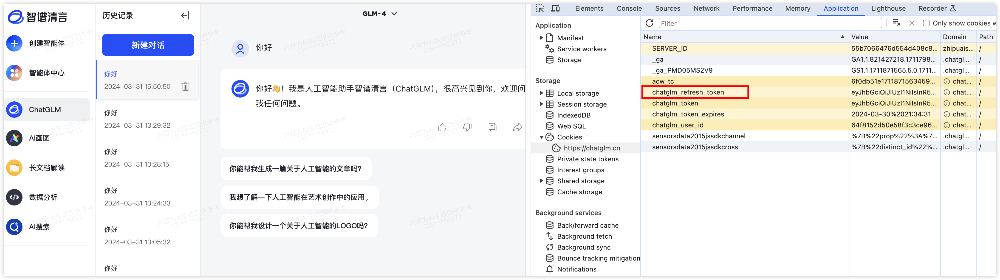

# openai通用代理转换

## 介绍

openai通用代理转换是一个用于将其他厂商服务转为openai 标准接口相应的工具. 通过该工具, 可以将其他厂商的服务转为openai 标准接口. 讯飞星火,通义千问,gemini,openai,copilot,double，kimi，智谱清言
使用spring2+webflux构建。支持docker部署

目前支持的厂商有:
- 科大讯飞 -> 讯飞星火
- 阿里巴巴 -> 通义千问
- 谷歌 -> gemini
- bito 
- openai
- copilot
- double（已限制失效）
- kimi chat 网页版
- 智谱清言 网页版模拟

## 部署方式

1. java本地构建，需要JDK11版本

2. docker部署(推荐)

   - 拉取docker镜像

     ```
     docker pull mahaonan/openai-proxy:latest
     ```

   - 在本地目录配置如下配置文件

     - config.properties，参考项目中的config.properties，配置ai信息
     - glm.json，如果需要使用智谱清言，配置该文件
     - kimi.json，如果需要使用kimi，配置该文件

     > 也可以使用下述指令拉取模板
     >
     > ```
     > curl -O https://raw.githubusercontent.com/mahaonanStart/openai-proxy/main/glm.json && curl -O https://raw.githubusercontent.com/mahaonanStart/openai-proxy/main/kimi.json && curl -O https://raw.githubusercontent.com/mahaonanStart/openai-proxy/main/config.properties
     > ```

   - 修改配置文件中的配置，详细设置见后面的配置模块

   - 启动容器

     ```
     ddocker run -d --name openai-proxy \
       -v  $PWD/config.properties:/app/config.properties \
       -v  $PWD/glm.json:/app/glm.json \
       -v  $PWD/kimi.json:/app/kimi.json \
       -p 9001:9001 \
     docker.io/mahaonan/openai-proxy:latest
     ```

     `-v`前面的参数是刚才配置的本地路径配置文件，可自定义

     后面的参数是容器内路径，不要修改

## 配置

### 通用配置

```
#通用的key前缀, 用于区分不同的服务,例如gpt-proxy-xfxh, gpt-proxy-ali, 如果是gpt-proxy-all,则会轮询所有可用服务
gpt.proxy.key-prefix = gpt-proxy

#是否打印日志
gpt.proxy.print-log = true

```

### 讯飞星火

```
gpt.proxy.xfxh.enabled=true
gpt.proxy.xfxh.url=https://spark-api.xf-yun.com/v3.5/chat
gpt.proxy.xfxh.app-id=
gpt.proxy.xfxh.api-key=
gpt.proxy.xfxh.api-secret=
```

### 通义千问

```
gpt.proxy.ali.enabled=true
gpt.proxy.ali.api-key=
gpt.proxy.ali.model=qwen-max
```

### bito

可在网页登录https://alpha.bito.ai/home/

然后打开F12 -> Application -> Storage -> Local storage中找到如下信息，对应关系如下

userId -> bito-user-id

wsId -> ws-id

userToken -> auth-token

cookieEmail -> email

注意：第三方软件中如果是gpt-3开头的会调用bito的BASIC模型

gpt4开头的会调用bito的ADVANCED模型

```java
aiModelType(proxyRequest.getModel().startsWith("gpt-4") ? "ADVANCED" : "BASIC")
```

```
gpt.proxy.bito.enabled=true
gpt.proxy.bito.bito-user-id=
gpt.proxy.bito.email=
gpt.proxy.bito.auth-token=
gpt.proxy.bito.ws-id=
```

### gemini

```
gpt.proxy.gemini.enabled=true
gpt.proxy.gemini.base-url=https://generativelanguage.googleapis.com
gpt.proxy.gemini.key=
```

### openai

```
gpt.proxy.openai.enabled=true
gpt.proxy.openai.base-url=https://api.openai.com
gpt.proxy.openai.api-key=
```

### copilot

```
gpt.proxy.copilot.enabled=false
gpt.proxy.copilot.base-url=https://api.githubcopilot.com
gpt.proxy.copilot.model=gpt-4
gpt.proxy.copilot.api-key=
```

> copilot代码来源于[gpt4-copilot-java](https://github.com/Yanyutin753/gpt4-copilot-java?tab=readme-ov-file),key和tokenUrl的概念参考该项目

> 如果默认的base_url访问太慢,可以使用cloudflare workers代理该地址

```javascript
const TELEGRAPH_URL = 'https://api.githubcopilot.com';

addEventListener('fetch', event => {
  event.respondWith(handleRequest(event.request))
})

async function handleRequest(request) {
  const url = new URL(request.url);
  url.host = TELEGRAPH_URL.replace(/^https?:\/\//, '');

  const modifiedRequest = new Request(url.toString(), {
    headers: request.headers,
    method: request.method,
    body: request.body,
    redirect: 'follow'
  });

  const response = await fetch(modifiedRequest);
  const modifiedResponse = new Response(response.body, response);

  // 添加允许跨域访问的响应头
  modifiedResponse.headers.set('Access-Control-Allow-Origin', '*');

  return modifiedResponse;
}
```

### double

已失效

```
gpt.proxy.double-ai.enabled=false
gpt.proxy.double-ai.api-key=
gpt.proxy.double-ai.model=Claude 3 (Opus)
```

### kimi

kimi-chat。

仅支持单人使用，切记切记！！！

kimi的使用有所不同，需要在项目根目录的kimi.json文件中，配置refresh_token

refresh_token的获取方法如下图所示：



只需要refresh_token即可，后续的access_token会自动续期

由于模拟的是网页端的接口，因此需要通过以下指令开始对话。

- 新建会话

  > 开始一轮新的对话，后续的对话共享上下文

- 删除会话

  > 删除当前会话

- 联网

  > 以联网开头的问题，会自动调用联网搜索，效果如图：
  >
  > 

- 刷新token

  > 如果遇到种种不能使用的场景，尝试该指令刷新token

- `https://xxx`

  > 直接输入一个链接，会调用网页分析，效果如图
  >
  > 

- 文件

  > 以文件开头的指令，会解析提问中的文件链接（目前仅支持一个），效果如下
  >
  > 

### 智谱清言

支持图片生成，联网搜索，文件解析，代码运行等。

仅支持单人使用，切记切记！！！

智谱清言的使用有所不同，需要在项目根目录的glm.json文件中，配置refresh_token

refresh_token的获取方法如下图所示：



只需要refresh_token即可，后续的access_token会自动续期

由于模拟的是网页端的接口，因此需要通过以下指令开始对话。

- 新建会话

  > 开始一轮新的对话，后续的对话共享上下文

- 删除会话

  > 删除当前会话

- 文件

  > 以文件开头的指令，会解析提问中的文件链接（目前仅支持一个)

- 刷新会话

  > 新建一个会话，不会删除之前的绘画

- 刷新token

  > 主动刷新access_token

## 使用方法

在支持输入openai服务的第三方软件，例如next-web上指定配置

例如想访问讯飞星火的服务，输入如下配置

url：http://127.0.0.1:9001

apiKey：gpt-proxy-xfxh


切换其他厂商，只需要更改api-key即可

- 讯飞星火：gpt-proxy-xfxh   
- 通义千问：gpt-proxy-ali
- gemini：gpt-proxy-gemini
- bito：gpt-proxy-bito
- openai：gpt-proxy-openai
- copilot: gpt-proxy-copilot
- kimi：gpt-proxy-kimi
- 智谱清言：gpt-proxy-glm
- 轮询：gpt-proxy-all

> 可通过gpt.proxy.key-prefix= xxx 配置更改前缀


## 配合使用软件
1. [next-web](https://github.com/ChatGPTNextWeb/ChatGPT-Next-Web)

2. [botgem](https://botgem.com/)

    > 全平台客户端，支持ios，安卓，macos，windows

3. [AI Coding](https://plugins.jetbrains.com/plugin/21263-ai-coding)
    > 自动生成 git message,idea中的gpt插件

## 说明

个人学习项目，仅供参考。

## 致谢
[gpt4-copilot-java](https://github.com/Yanyutin753/gpt4-copilot-java?tab=readme-ov-file)

