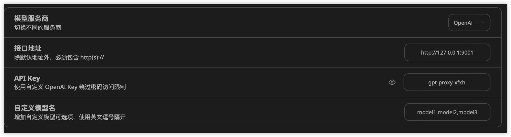

# openai通用代理转换

## 介绍

openai通用代理转换是一个用于将其他厂商服务转为openai 标准接口相应的工具. 通过该工具, 可以将其他厂商的服务转为openai 标准接口.
使用spring2+webflux构建

目前支持的厂商有:
- 科大讯飞 -> 讯飞星火
- 阿里巴巴 -> 通义千问
- 谷歌 -> gemini
- bito 
- openai

## 版本要求

jdk11
springboot2

## 配置

### 通用配置

```
#通用的key前缀, 用于区分不同的服务,例如gpt-proxy-xfxh, gpt-proxy-ali, 如果是gpt-proxy-all,则会轮询所有可用服务
gpt.proxy.key-prefix = gpt-proxy

#是否打印日志
gpt.proxy.print-log = true

```

### 讯飞星火

```
gpt.proxy.xfxh.enabled=true
gpt.proxy.xfxh.url=https://spark-api.xf-yun.com/v3.5/chat
gpt.proxy.xfxh.app-id=
gpt.proxy.xfxh.api-key=
gpt.proxy.xfxh.api-secret=
```

### 通义千问

```
gpt.proxy.ali.enabled=true
gpt.proxy.ali.api-key=
gpt.proxy.ali.model=qwen-max
```

### bito

```
gpt.proxy.bito.enabled=true
gpt.proxy.bito.bito-user-id=
gpt.proxy.bito.email=
gpt.proxy.bito.request-id=
gpt.proxy.bito.header-authorization=
gpt.proxy.bito.session-id=
gpt.proxy.bito.u-id=
gpt.proxy.bito.ws-id=
```

### gemini

```
gpt.proxy.gemini.enabled=true
gpt.proxy.gemini.base-url=https://generativelanguage.googleapis.com
gpt.proxy.gemini.key=
```

### openai

```
gpt.proxy.openai.enabled=true
gpt.proxy.openai.base-url=https://api.openai.com
gpt.proxy.openai.model=
gpt.proxy.openai.api-key=
```

## 使用方法

在支持输入openai服务的第三方软件，例如next-web上指定配置

例如想访问讯飞星火的服务，输入如下配置

url：http://127.0.0.1:9001

apiKey：gpt-proxy-xfxh



切换其他厂商，只需要更改api-key即可

- 讯飞星火：gpt-proxy-xfxh   
- 通义千问：gpt-proxy-ali
- gemini：gpt-proxy-gemini
- bito：gpt-proxy-bito
- openai：gpt-proxy-openai
- 轮询：gpt-proxy-all

> 可通过gpt.proxy.key-prefix= xxx 配置更改前缀


## 配合使用软件
1. [next-web](https://github.com/ChatGPTNextWeb/ChatGPT-Next-Web)

2. [botgem](https://botgem.com/)

    > 全平台客户端，支持ios，安卓，macos，windows

3. [AI Coding](https://plugins.jetbrains.com/plugin/21263-ai-coding)
    > 自动生成 git message,idea中的gpt插件

## 说明

个人学习项目，仅供参考。
